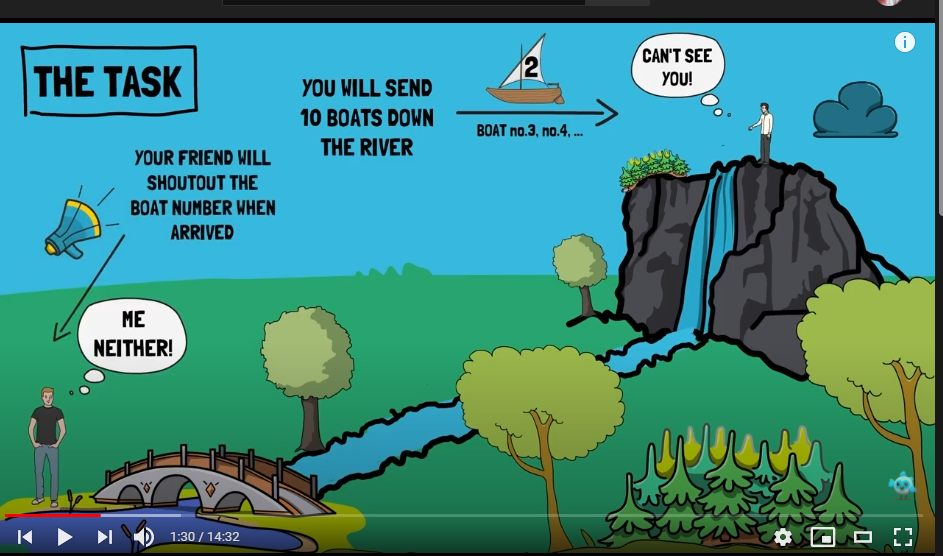

### Explaining Future And Stream in Flutter

**Future**

What is Future?

Future ဆိုတာက အနာဂတ်မှာ ရှိနိုင်တဲ့ အရာကိုခေါ်တာပေါ့။ နောက်တာပါ။

အမှန်တကယ်တော့  လုပ်ရတဲ့ အလုပ်ကို အလုပ်လုပ်နေတုန်း ခဏစောင့်ပေးတာပေ့ါ။

Example အနေနဲ့ ကျွန်တော်တို့ Network ဆီက data လှမ်းယူတယ်ဆိုကြပါစို့။ အနည်းဆုံးတော့ ကျွန်တော်တို့ စောင့်ရမယ်။ Network ဆီကယူတာဖြစ်တဲ့အတွက် ERROR TYPE(403,404,500 စသဖြင့်)လည်း လာနိုင်တယ်။

အဲမှာ State သုံးမျိုး ရှိတယ်။ 

- Uncompleted
- Completed with a value
- Completed with an error

Future က asynchronous ဖြစ်တယ်။ Parallel Run တယ်ပြောလို့ရတယ်။ အဲမှာ သုံးစရာစာလုံးတွေပါလာတာက **async**  နဲ့ **await** ဆိုပြီး အသစ် နှစ်လုံးပါလာတယ်။

အဲနှစ်လုံးဟာ ငါတို့ asynchronous လုပ်မယ်လို့ကြေငြာပြီး လိုချင်တဲ့ အဖြေရအောင် လုပ်မယ်ဆိုတဲ့ သဘောပါ။

Guideline နှစ်ခုရှိပါတယ်။အဲဒါကို ကျွန်တော် offical documentation ထဲကသွားယူလာတာပါ။

- **To define an async function, add `async` before the function body:**

  ```dart
  void main() async { ··· }
  ```

- **The `await` keyword works only in `async` functions.**

  ```dart
  print(await createOrderMessage());
  ```


Example code ကို docs ထဲကယူပြထားပါတယ်။

```dart
Future<void> printOrderMessage() async {
  print('Awaiting user order...');
  var order = await fetchUserOrder();
  print('Your order is: $order');
}

Future<String> fetchUserOrder() {
  // Imagine that this function is more complex and slow.
  return Future.delayed(Duration(seconds: 4), () => 'Large Latte');
}

Future<void> main() async {
  countSeconds(4);
  await printOrderMessage();
}

// You can ignore this function - it's here to visualize delay time in this example.
void countSeconds(int s) {
  for (var i = 1; i <= s; i++) {
    Future.delayed(Duration(seconds: i), () => print(i));
  }
}
```

The output will be

```
Awaiting user order...
1
2
3
4
Your order is: Large Latte
```

Future codelab အပြည့်အစုံကို [ဒီမှာ](https://dart.dev/codelabs/async-await) ကြည့်နိုင်ပါတယ်။


**Stream**

Stream ဆိုတာ နားလည်အောင် ရှင်းပြရရင် ပုံလေးထည့် ထားလိုက်ပါမယ်။



ပုံကတော့ [ဒီက](https://www.youtube.com/watch?v=toPtm6eyyeE&list=PLptHs0ZDJKt_T-oNj_6Q98v-tBnVf-S_o&index=3&t=90s) ယူထားတာပေါ့။ သူကတော့ BLOC အကြောင်းမှာ Stream ကိုထည့်ရှင်းထားတာ သဘောကျလို့ယူထားတာပါ။ ကြည့်ချင်ရင် တော့ ကျန်တာကိုမကြည့်ပဲ Stream ကိုရှင်းတာပဲကြည့်ပါ။


ဒီပုံမှာ ကြည့်မယ်ဆိုရင် ကျွန်တော်က တောင်ထိပ်မှာပါ။ ကျွန်တော့် ဘော်ဒါက အောက်မှာပါ။ ကျွန်တော်က ငါးစက္ကန့် ခြား တစ်ခါ လှေတစ်စီးလွှတ်ပါမယ်။ ဘော်ဒါက ကျွန်တော်လှေနံပါတ်ကို တွေ့ရင် အော်မယ်" ငါတွေ့ပြီ လှေနံပါတ်ကို" ဆိုပြီး အော်ပြမယ်။


အဲတာက Stream ရဲ့ အလုပ်လုပ်ပုံပေါ့။ Future နဲ့ဆင်တူပေမဲ့ Future က one time ပဲ။

stream ကတော့ မသတ်သရွေ့ အလုပ်လုပ်နေတယ်ပေါ့။

Example လေးကြည့်ကြရအောင်။

```dart
Stream<int> countStream(int to) async* {
  for (int i = 1; i <= to; i++) {
    if (i == 4) {
      throw Exception('Intentional exception');
    } else {
      yield i;
    }
  }
}
```

Stream codelab အပြည့်အစုံကို [ဒီမှာ](https://dart.dev/tutorials/language/streams) ကြည့်နိုင်ပါတယ်။

