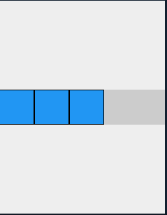
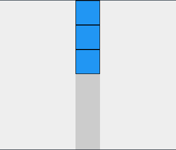

### Explaining Useful Widgets

- [Container](#container)
-  [Padding](#padding)
-  [Card](#card)
- [Scaffold](#scaffold)
- [Button](#button)
- [TextField](#textfield) 
- [Text](#text) 
- [Image(Both Network and Asset)](#imageboth-network-and-asset) 
- [Expanded And Flexible](#expandedandflexible) 
- [Rows and Columns](#rows-and-columns)
-  [ListView/GridView](#listviewgridview)
-  [SingleChildScrollView](#singlechildscrollview)

## Container

Container တွေဆိုတာက margin,padding ,background color, width, height တွေစတဲ့ attribute တွေကို သူ့ရဲ့ နောက်မျိုုးဆက် widget တွေကို support ပေးတဲ့ widget ပါ။

မျက်လုံးထဲမြင်အောင်ပြောရရင် ဒီလိုမျိုုးပါ။


```dart
Container(
	width: 200.0,  
    height: 100.0,  
    color: Colors.green,   
    padding: EdgeInsets.all(35),  
    margin: EdgeInsets.all(20),  
    child:Text("Hello world"),
)
```

ပြီးတော့ ကျန်တဲ့ Properties တွေကို လိုက်လုပ်ကြည့်ကြမယ်

**Alignment**

Container ရဲ့ Alignment ကိုညှိတာပါ။ 

```dart
Container(
	color:Colors.green,
    alignment:Alignment.center,
    child:Text("Hello")
)
```

**Decoration**

Containerရဲ့ Decoration ကတော့ သူ့ရဲ့ နောက်မျိုးဆက် Widget ကို နောက်က‌နေ Decorate လုပ်ပေးတာပေါ့

ဘယ်လိုမျိုုးလဲဆိုတော့

```dart
Container(
	decoration:BoxDecoration(
		border: Border.all(color: Colors.black, width: 4),  
    borderRadius: BorderRadius.circular(8),  
    boxShadow: [  
            new BoxShadow(color: Colors.green, 					offset: new Offset(6.0, 6.0),),  
        ],
	),
	child:Text("Hello world")
)
```

BoxDecoration အကြောင်းသိချင်ရင်တော့ [ဒီမှာ](https://www.woolha.com/tutorials/flutter-using-boxdecoration-examples) ကြည့်လို့ရပါတယ်

အကယ်၍မှ Container အကြောင်း အသေးစိတ်သိချင်သေးတယ်ဆိုရင်တော့ [ဒီမှာ](https://www.javatpoint.com/flutter-container) ဆက်လေ့လာလို့ရပါတယ်။

ဆရာအနေနဲ့ လိုက်ပြပေးတာပိုကောင်းပါလိမ့်မယ်။ Lecture မှာ။


## Padding

ကိုဘယ်လိုအချိန်မှာသုံးသလဲဆိုတော့ widget တစ်ခုနဲ့ တစ်ခုကို နေရာလေးခြားချင်တဲ့‌ နေရာကျရင် သုံးပါတယ်။

```dart
Padding(
    padding:EdgeInsets.all(8),
	child:Text("Hello world")
)
```

ဒီ ကုဒ်ကို ကြည့်လိုက်ရင် ကျွန်တော်တို့သည် Text("Hello world")ရဲ့ ဘေးမှာ 8 စီခြားသွားတာပေါ့

all လည်းရှိသေးသလို direction နဲ့လည်းသွားလို့ရပါသေးတယ် သီးသန့် ဘယ်ကိုပဲ နေရာခြားချင်တယ် အပေါ်ကိုပဲ ခြားချင်တယ်ဆိုလည်းရပါတယ်။

```
//This is the one with directions(horizontal and vertical)
Padding(
	padding:EdgeInsets.symmetrics(horizontal:2,vertical:8)
	child:Text("Hello world")
)
```


ပြီးတော့ တစ်ခုချင်းဆီဆို only နဲ့သုံးလို့ရတယ်

```dart
Padding(
	 padding: const EdgeInsets.only(
      left: 40,
      top: 20,
      right: 40,
      bottom: 20,
    ),
	child:Text("Hello world")
)
```


## Card


## Scaffold

Flutter Scaffold ကို‌တော့ application ရဲ့ အခြေခံ layout လို့ပြောလို့ရပါတယ်။ Device Screen တစ်ခုလုံးကို ရယူနိုင်ထားပါတယ်။ သူ့ဆီကနေမှ သူ့နောက်မျိုးဆက် widget တွေဟာ UI လှလှနဲ့ ဆက်ပြီးအလုပ်လုပ်နိုင်နေတာဖြစ်ပါတယ်။

သူ့ရဲ့ main သုံးတဲ့ လူသုံးအရမ်းများတဲ့ အရာတွေရှိပါတယ်။ ဒါတွေကတော့

- AppBar
- Body
- Floating Action Button
- Drawer
- Bottom Navigation Bar

**AppBar **

Appbar ကတော့ ဒီလိုပုံစံမျိုးဖြစ်တယ်။


ဒါမျိုးကိုဘယ်လိုရေးမလဲဆိုတော့ အောက်ကလိုရေးလို့ရတယ်။

```dart
Widget build(BuildContext context)   
{  
  return Scaffold(  
    appBar: AppBar(  
      title: Text('First Flutter Application'),  
    ), );  
}  
```

**Body**

body ကတော့ appbar အောက်က အဖြူရောင်နေရာလေးပါ။ အဲမှာ widget တွေထပ်တိုးပြီးရေးလို့ရပါတယ်။

```dart
Widget build(BuildContext context) {   
return Scaffold(   
    appBar: AppBar(   
    title: Text('First Flutter Application'),   
    ),   
    body: Center(   
    child: Text("Welcome to Javatpoint",   
        style: TextStyle( color: Colors.black, fontSize: 30.0,   
        ),   
         ),   
    ),  
}  
```

**Floating Action Button**

ပုံတွေနဲ့ ပြတာပိုမြင်မယ်လို့ ယူဆတဲ့အတွက် ပြထားတာဖြစ်ပါတယ်


ဘယ်လိုရေးမလဲဆိုတာကတော့ အောက်မှာပြပေးထားပါတယ်။

```dart
Widget build(BuildContext context) {   
  return Scaffold(   
    appBar: AppBar(title: Text('First Flutter Application')),   
    body: Center(   
        child: Text("Welcome!!"),   
    ),   
    floatingActionButton: FloatingActionButton(   
        elevation: 8.0,   
        child: Icon(Icons.add),   
        onPressed: (){   
           print('I am Floating Action Button');  
        }   
    );   
}  
```

**Drawer**

သူကဘယ်လိုမျိုးလဲဆိုတော့ ဒီလိုမျိုုးလေး


ဘယ်လို ရေးမလဲဆိုရင် Scaffold ထဲက drawer(parameter) ရှိတယ်။ အဲမှာ ‌ရေးရမှာပေါ့နော်

```dart
Scaffold(
	drawer:Drawer(
    	child:Widgets()
  	)
)
```


**Bottom Navigation Bar**

Bottom Navigation bar ကို ပုံပဲပြထားဦးမယ်။ နည်းနည်းခက်လို့ ရေးရမှာ


## Button

Flutter မှာ Button ခလုတ်တွေအများကြီးရှိပါတယ်

- Flat Button
- Raised Button
- Floating Button
- Drop Down Button
- Icon Button
- Outline Button
- PopupMenu Button

**Flat Button**

Text Label ပဲပါတဲ့ Button တစ်ခုဖြစ်တယ်။ ဘာမှ Decoration လောက်လောက်လားလား မပါပဲနဲ့ Elevation ခေါ်တဲ့ ‌ဖောင်းကြွ လည်းမပါဘူး။ 

```dart
FlatButton(  
     child: Text('SignUp', style: TextStyle(fontSize: 20.0),),  
     onPressed: () {},  
)
```

Result ကတော့


**Raised Button**

ဒါကတော့ Material Widget ပေါ်မှာ အခြေခံထားတဲ့ Flat Button နဲ့ ဆင်တူတဲ့ Button တစ်ခုဖြစ်တယ်။ ဒါပေမဲ့ မတူတာတစ်ချက် က Elevation ခေါ်တဲ့ ဖောင်းကြွ ပါလာတယ်။ ပြီးတော့ attribute တွေလည်းပိုပါလာတယ်။Flat Button ထက်စာရင်။

ထူးခြားတာက onPressed() အပြင် onLongPress() ဆိုတဲ့ ခလုတ်နှိပ်တဲ့အခါ ခေါ်တဲ့ method  တွေထပ်တိုးလာတာပဲဖြစ်တယ်။

```dart
RaisedButton(  
       child: Text("Click Here",style:TextStyle(fontSize:20),),  
       onPressed: (){},  
       color: Colors.red,  
       textColor: Colors.yellow,  
       padding: EdgeInsets.all(8.0),  
       splashColor: Colors.grey,  
)  
```


**Drop Down Button**

Option တွေ ရှိကြတယ်။ အဲထဲက တစ်ခုကို ရွေးချင်တဲ့ ပုံစံမျိုးလုပ်ချင်တဲ့ အချိန်ကျ DropDown Button ကိုသုံးလို့ရတယ်ပေါ့။

```dart
class MyApp extends StatefulWidget {  
  @override  
  _MyAppState createState() => _MyAppState();  
}  
  
class _MyAppState extends State<MyApp> {  
  List<ListItem> _dropdownItems = [  
    ListItem(1, "GeeksforGeeks"),  
    ListItem(2, "Javatpoint"),  
    ListItem(3, "tutorialandexample"),  
    ListItem(4, "guru99")  
  ];  
  
  List<DropdownMenuItem<ListItem>> _dropdownMenuItems;  
  ListItem _itemSelected;  
  
  void initState() {  
    super.initState();  
    _dropdownMenuItems = buildDropDownMenuItems(_dropdownItems);  
    _itemSelected = _dropdownMenuItems[1].value;  
  }  
  
  List<DropdownMenuItem<ListItem>> buildDropDownMenuItems(List listItems) {  
    List<DropdownMenuItem<ListItem>> items = List();  
    for (ListItem listItem in listItems) {  
      items.add(  
        DropdownMenuItem(  
          child: Text(listItem.name),  
          value: listItem,  
        ),  
      );  
    }  
    return items;  
  }  
  
  @override  
  Widget build(BuildContext context) {  
    return Scaffold(  
      appBar: AppBar(  
        title: Text("DropDown Button Example"),  
      ),  
      body: Column(  
        children: <Widget>[  
          Padding(  
            padding: const EdgeInsets.all(10.0),  
            child: Container(  
              padding: const EdgeInsets.all(5.0),  
              decoration: BoxDecoration(  
                  color: Colors.greenAccent,  
                  border: Border.all()),  
              child: DropdownButtonHideUnderline(  
                child: DropdownButton(  
                    value: _itemSelected,  
                    items: _dropdownMenuItems,  
                    onChanged: (value) {  
                      setState(() {  
                        _itemSelected = value;  
                      });  
                    }),  
              ),  
            ),  
          ),  
          Text("We have selected ${_itemSelected.name}"),  
        ],  
      ),  
    );  
  }  
}  
  
class ListItem {  
  int value;  
  String name;  
  
  ListItem(this.value, this.name);  
}  
```


**Icon Button**

ရှင်းရှင်းပြောရင် Icon ကိုနောက်ခံထားထားတဲ့ button ပါပဲ။

```dart
IconButton(  
    icon: Icon(Icons.volume_up),  
    iconSize: 50,  
    color: Colors.brown,  
	tooltip: 'Increase volume by 5',  
	onPressed: () {   
    },  
),  
```


**Popup Menu Button**

Menu Button လေးတွေ တွေ့ဖူးကြမယ်ထင်ပါတယ်။

(အမှန်က နာမည်ပါပါနေတာကို ဘယ်လိုပြော ရတော့မှန်းမသိတော့လို့)

```dart
const List<Choice> choices = const <Choice>[  
  const Choice(name: 'Wi-Fi', icon: Icons.wifi),  
  const Choice(name: 'Bluetooth', icon: Icons.bluetooth),  
  const Choice(name: 'Battery', icon: Icons.battery_alert),  
  const Choice(name: 'Storage', icon: Icons.storage),  
];  
```

```dart
PopupMenuButton<Choice>(  
    onSelected: _select,  
    itemBuilder: (BuildContext context) {  
        return choices.skip(0).map((Choice choice) {  
        	 return PopupMenuItem<Choice>(  
                    value: choice,  
                    child: Text(choice.name),  
             );  
        }).toList();  
    },  
)
```


**Outline Button**

Outline Button ကတော့ ဘောင်ပဲပါပြီး အတွင်းသား က transparent ဖြစ်တဲ့ Button ပေါ့ဗျာ။

```dart
OutlineButton(  
	child: Text("Outline Button", style:TextStyle(fontSize:20.0),),  
	highlightedBorderColor: Colors.red,  
	shape: RoundedRectangleBorder(  
		borderRadius: BorderRadius.circular(15)),  
	onPressed: () {},  
),  
```


ကျန်နေတဲ့ Button အပြည့်အစုံ ကို [ဒီမှာ](https://www.javatpoint.com/flutter-buttons) ကြည့်လို့ရပါတယ်။


## TextField

Helo world

gg

wee

jefkjek

kejfkejf

efkjekfj

kfjekfjek

ekjfkejfkej

fkejfkejfkej

## Text

Text ဆိုတဲ့ widget ကတော့ စာသားတွေကို ပြတဲ့နေရာမှာ သုံးတာပေါ့။ ဘယ်နေရာမှာပဲဖြစ်ဖြစ် စာကပြရတာကြီးပဲဆိုတော့ Text ကတော့ အရေးပါတဲ့ အရာပေါ့။

အဲတော့ တစ်ချက်လောက်ဘယ်လိုသုံးတယ်ဆိုတာ ကြည့်ကြည့်ရအောင်။

```dart
Widget build(BuildContext context) {  
    return Scaffold(  
      appBar: AppBar(  
          title:Text("Text Widget Example")  
      ),  
      body: Center(  
          child:Text("Welcome to Javatpoint")  
      ),  
    );  
}  
```

Text မှာ ဘာတွေပါလဲဆိုတာကိုတစ်ချက် List ထုတ်ပြပါမယ်။

အဲမှာတစ်ချက်ပြောချင်လာတာက Flutter က open-source ဖြစ်တယ်။ အဲတာမလို့ source code ကိုတတ်နိုင်သလောက်၀င်ဖတ်ကြည့်ပါ။ ပညာရတာပေါ့။

အခုချိန်(စာရေးနေတဲ့အချိန် အရေးအခင်းဖြစ်နေတဲ့အချိန်ဆိုတော့ စာလည်းလုပ်ချင်စိတ်မရှိ စာဖတ်ဖို့နေရာ‌လေးတစ်ခုဖန်တီးပေးချင်လို့သာ ကြိုးစားရေးနေတာပါ) မှာ လုပ်ချင်စိတ်မရှိကြပါဘူး။

အဲတော့ ပြောချင်တာလည်း ရှည်သွားပြီဆိုတော့ ပြန်စကြရအောင်။

```dart
const Text(String data,{  
    Key key,  
    TextStyle style,  
    StrutStyle strutStyle,  
    TextAlign textAlign,  
    TextDirection textDirection,  
    TextOverflow overflow,  
    bool softWrap,  
    double textScaleFactor,  
    int maxLines,  
    String semanticsLabel,  
    TextWidthBasis textWidthBasis,  
    TextHeightBehavior textHeightBehavior  
    }  
)  
```

 ကျွန်တော် ဒီမှာ လူသုံးများတဲ့ အရာတွေဖြစ်တဲ့ Text Style,Text Align , TextDirection, maxLines, TextOverFlow တွေကို ပြောသွားရှင်းသွားမှာဖြစ်ပါတယ်။

**Text Style**

- background->Text ရဲ့ နောက်ခံအနေနဲ့ လုပ်ချင်တာရှိရင် ဒီဟာကို သုံးလို့ရတယ်။
- fontWeight->Text ရဲ့ အထူကို သတ်မှတ်တာပါ။
- fontSize->Text Font အရွယ်အစား ကိုချိန်ချင်ရင် သုံးတယ်
- fontFamily->Text Font အမျိုးအစားတွေကို ပြောင်းချင်ရင်သုံးတယ်။လုပ်နည်း အပြည့်အစုံကို [ဒီမှာ](https://www.youtube.com/watch?v=fDRtpjHfOuw) ကြည့်နိုင်ပါတယ်။
- fontStyle->Font ရဲ့ စတိုင်ပေါ့။ နမူနာအနေနဲ့ဆိုရင် (Bold, italic)
- Color->Text ရဲ့ အရောင် ကိုပြောင်းချင်တဲ့အခါကျရင် သုံးရပါမယ်၊
- letterSpacing->စာတစ်လုံးချင်းရဲ့ အကွာအ‌ေ၀းကို သတ်မှတ်ပေးတာပါ။
- shadows->Text ရဲ့ နောက်မှာ shadow ထည့်တာပါ

**Text Align**

Text ကိုဘယ်နေရာမှာ ထားမလဲဆိုတာ ဒီလိုမျိုးပါ။

```dart
Text("text",textAlign:TextAlign.left)
```

**maxLines**

Text widget မှာထည့်မယ့် String တစ်ခုဟာ အရမ်းရှည်နေပြီဆိုရင် ပြမဲ့ line limit ကို ကန့်သတ်လိုက်တာပေါ့့

```dart
Text("Lorem ipsum dolor sit amet consectetur adipisicing elit. Maxime mollitia,
molestiae quas vel sint commodi repudiandae consequuntur voluptatum laborum
numquam blanditiis harum quisquam eius sed odit fugiat iusto fuga praesentium
optio, eaque rerum! Provident similique accusantium nemo autem", maxLines:2)
```


**TextOverFlow**

အပေါ် ကလို maxLines ထည့်လိုက်ရင် ကျန်တဲ့ စာသားတွေကို ဘယ်လို ပြမလဲဆိုတဲ့မေးခွန်းက ၀င်လာမယ်။ အဲမေးခွန်းအတွက် ဒီ TextOverFlow ကဖြေရှင်းပေးထားတယ်။

အဲမှာ အသုံးများတဲ့ အရာလေးတွေကို ပြထားပါမယ်။ [လက်တွေ့]()  ပြထားတာရှိရင် ပိုနားလည်ရလွယ်ပါလိမ့်မယ်။

စာနဲ့လည်းရေးထားပါမယ်။clip, ellipsis , fade နဲ့ visible တို့ဖြစ်ပါတယ်။

```DART
Text("Lorem ipsum dolor sit amet consectetur adipisicing elit. Maxime mollitia,
molestiae quas vel sint commodi repudiandae consequuntur voluptatum laborum
numquam blanditiis harum quisquam eius sed odit fugiat iusto fuga praesentium
optio, eaque rerum! Provident similique accusantium nemo autem", maxLines:2,overflow:TextOverflow.ellipsis,)
```


## Image(Both Network and Asset)

Image တွေကတော့ Photo တွေပြဖို့အတွက် သုံးတဲ့ widget ပဲဖြစ်ပါတယ်။ သူ့မှာ နှစ်မျိုးရှိပါတယ်။ AssetImage ဆိုတာ မိမိဖုန်းထဲမှာ ရှိနေတဲ့ ပုံ သို့ application မှာထည့်ထားတဲ့ ပုံတွေကို ပြဖို့သုံးတာဖြစ်ပါတယ်။ ရေးနည်းကိုလည်း အောက်မှာတစ်ခါတည်းရှင်းသွားပါမယ်။ ထည့်ပေးရမှာကတော့ ပြချင်တဲ့ ပုံရဲ့ ပတ်လမ်းကြောင်းကို ထည့်ပေးရမှာပါ။

Image ကို Locally ပြချင်ရင်

Folder structure assets-> images ကိုဆောက်, images အောက်မှာ ပုံတွေထည့့်

pubsepc.yaml မှာ ဒီလိုလေးသွားရေးပေး

```dart
flutter:
   assets:
     - assets/images/
```

ပြီးရင် ကျန်တာဆက်ရေးလို့ ရပြီ။

```dart
Image.asset('assets/images/my_profile.png')
```

Network Imageဆိုတာ အင်တာနက်မှာရှိတဲ့ ပုံတွေကိုပြမှာဖြစ်ပါတယ်။ လိုအပ်တာကတော့ အင်တာနက်မှာ ရှိတဲ့ image url ကို ထည့်ပေးရပါမယ်။ အင်တာနက်ကနေ ဆွဲပြရတာကြောင့် ပုံပေါ် ဖို့ ခဏတော့စောင့်ရပါလိမ့်မယ်။

ရေးရင်တော့ ဒီလိုရေးရပါလိမ့်မယ်။

```dart
Image.network("https://static.wikia.nocookie.net/haikyuu/images/a/a4/Haikyu_S4.jpg/revision/latest?cb=20200111012854")
```

ပြီး container နောက်မှာ decoration အနေနဲ့ image တွေထားပြလို့ရပါသေးတယ်။ အဲမှာတော့ တစ်ခါတည်း နှစ်ခုလုံးလုပ်ပြသွားပါမယ်။

ဒီတစ်ခုက AssetImage အတွက်ပါ။

```DART
Container(
	height: 120.0,
    width: 120.0,
    decoration: BoxDecoration(
      	image: DecorationImage(
          image: AssetImage(
              'assets/images/my_profile.png'),
        ),
      ),
)
```

 ဒီတစ်ခုကတော့ NetworkImage အတွက်ပါ။

```dart
Container(
	height: 120.0,
    width: 120.0,
    decoration: BoxDecoration(
      	image: DecorationImage(
          image: NetworkImage( "https://static.wikia.nocookie.net/haikyuu/images/a/a4/Haikyu_S4.jpg/revision/latest?cb=20200111012854"),
        ),
      ),
)
```


## Expanded and Flexible

### Expanded

### Flexible

## Rows and Columns

ကျွန်တော်တို့ ဒီကောင်က အရေးကြီးတဲ့ အထဲမှာ ပါပါတယ်။ကျွန်တော်တို့ အသုံးအရမ်းများမယ့် widget နှစ်ခုလည်းဖြစ်ပါတယ်။

> Row နဲ့ Column ဟာ ကျွန်တော်တို့ ထည့် ချင်တဲ့ widget တွေကို Horizontally(in Row) နဲ့ Vertically(in Column) ပြင်ဆင်ပေးနိုင်တယ်။ Properties တွေကလည်း ဆင်တူတဲ့အတွက် တစ်ခါတည်းအတူတူ သင်ကြ ပြောကြတာဖြစ်ပါတယ်။

Row နဲ့ Column ထဲက child widget တွေကို align လုပ်တဲ့အချိန်မှာ တူနေတဲ့ attribute တွေကို ရှေ့မှာထုတ်ပြီးပြောလိုက်ပါတယ်။

* start(children တွေကို main axis အစမှာ ထားချင်ရင်သုံး)

* end(children တွေကို main axis အဆုံးမှာ ထားချင်ရင်သုံး)

* center(children တွေကို main axis အလယ်မှာထားချင်ရင်သုံး )

* spaceBetween(children တွေကို ညီညီမျှမျှ နေရာလွတ်ခြားထားပေးချင်ရင်သုံး ဒါပေမဲ့ အစဘေးနဲ့ အဆုံးဘေးတွေမှာ နေရာလွတ်မရှိဘူး)

   

* spaceAround(children တွေရဲ့ အစ‌ဘေးနဲ့ အဆုံးဘေးတွေမှာ space တွေရှိတယ်။ အဲ space တွေက အလယ်က space တွေရဲ့ တစ်၀က်ဆီရှိတယ်။ )

  

* spaceEvenly(children တွေဘေးမှာ အကုန်နေရာလွတ်တွေတူ)

  

### Row

Row ရဲ့ main Axis နဲ့ cross Axis ကိုပြထားပေးတာပါ။


```dart
Row(
	mainAxisAlignment: MainAxisAlignment.start,
    children:[
        BlueBox(),
		BlueBox(),
		BlueBox(),
    ]
)
```

Output



### Column


Column ရဲ့ main Axis နဲ့ cross Axis ကိုပြထားပေးတာပါ။


```dart
Row(
	mainAxisAlignment: MainAxisAlignment.start,
    children:[
        BlueBox(),
		BlueBox(),
		BlueBox(),
    ]
)
```

Output




## ListView/GridView

ListView , GridView တွေဟာ ကျွန်တော်တို့ပြစရာ အရှည်ကြီး ရှိတဲ့ ဟာတွေ ပြချင်ရင် သုံးပါတယ်။

TIP::ကျွန်တော်ကတော့ သူတို့ရဲ့ လုပ်ပုံ လုပ်နည်းလေးတွေသိချင်လို့ရင် Flutter Widget of the week ကဟာတွေကြည့်ဖြစ်တယ်။ Listview နဲ့ GridView အကြောင်းလေးတွေ ကြည့်ကြည့်ပါ။

ListView type သုံးမျိုး ရှိပါတယ်။ ဒါတွေကတော့

- Original ListView
- ListView.builder
- ListView.separated

#### Original ListView

children widget နှစ်ခု သုံးခု အနည်းပဲ ရှိတဲ့ အချိန်ကျ‌ရင်တော့ သုံးပါတယ်။

ဥပမာ ကတော့ ဒီမှာပါ။

```dart
ListView(
	children:<Widget>[
      ItemOne(),
      ItemTwo(),
      ItemThree(),
    ],
)
```

#### ListView.builder()

builder() constructor က ထပ်ခါ ထပ်ခါပြရမယ့် items တွေကို ဆောက်ပေးသွားတာဖြစ်တယ်။

သူက parameters နှစ်ခုကို အဓိက ယူတယ်။ itemCount(အဲဒါသည် ပြမယ့် list အရေအတွက်) နဲ့ itemBuilder( list item တစ်ခုချင်းစီကို ဘယ်လို ဆောက်မလဲဆိုတာပေ့ါ)။


User Screen မှာရှိတဲ့ screen size အပေါ် မူတည်ပြီး List Item Number အရေအတွက်တည်ဆောက်တယ်။ scroll လိုက်တာနဲ့ အပေါ်ရောက် သွားတဲ့ item တွေဟာ ဖျက်ပလိုက်တယ်။

အဲတော့ memory အစားသက်သာတယ်။ Performance ကောင်းတယ်လို့ မြင်သာတာပေါ့။

အဲတာကို **construct lazily** လို့ ခေါ်တယ်။

```dart
ListView.builder(
  itemCount: itemCount,
  itemBuilder: (context, position) {
    return listItem();
  },
),
```

#### ListView.separated()

Listview separate က အရှင်းဆုံးပြောရရင် List နှစ်ခုပေါင်း ဆောက်ထားတာပဲ။ ပထမက ကျွန်တော်တို့ တကယ်ပြချင်တဲ့ List, ဒုတိယတစ်ခုက List Item တစ်ခုချင်းဆီမှာ ခြားမယ့် List တစ်ခုပေါ့။

**itemCount ကျိန်းသေလိုပါတယ်**

TIP:: အခုပြောတဲ့ Listview ကို ကျွန်တော်တို့တွေ main list တွေကြားမှာ advertisement တွေကို ထည့်မယ်ဆိုရင်ကောင်းကောင်းသုံးလို့ရတယ်။ ပုံကြမ်းလေးပြထားပေးမယ်။


```dart
ListView.separated(
      itemBuilder: (context, position) {
        return ListItem();
      },
      separatorBuilder: (context, position) {
        return SeparatorItem();
      },
      itemCount: itemCount,
),
```

**Listview** အကြောင်း ဆက်လေ့လာမယ်ဆိုရင်တော့ [ဒီမှာ](https://medium.com/flutter-community/flutter-listview-and-scrollphysics-a-detailed-look-7f0912df2754) ဆက်ဖတ်ကြည့်လို့ရပါတယ်။

ဆိုတော့ **GridView** အကြောင်း ထပ်ဆက်ပါမယ်။

ဒီကောင်ကကျ မျက်လုံးထဲမြင်အောင်ပြရရင် ဒီလိုမျိုးဖြစ်တယ်။


အဲလိုလေးဖြစ်တယ်။

သူ့မှာ ‌ရေးလို့ရတဲ့ Grid လေးမျိုးလောက်ရှိတယ်။ ဒါတွေကတော့

- GridView.count()
- GridView.builder()
- GridView.custom()
- GridView.extent()

ကျွန်တော်ကတော့ အဓိကအနေနဲ့ အပေါ်က နှစ်မျိုးကိုပဲ ပြောသွားမှာဖြစ်ပါတယ်။

ကျန်တာအနေနဲ့ကတော့ ကိုယ့်ဟာကိုယ်ဖတ်စေချင်တဲ့ အတွက် [Link](https://stackoverflow.com/questions/65939515/what-is-the-difference-between-the-grideview-custom-grideview-extent-widget-la)ပဲချသွားပေးမှာဖြစ်ပါတယ်။

### GridView.count()

သူ့ကိုတော့ grid အရေအတွက် သိပြီးသားနေရာတွေမှာဆို သုံးလို့ရပါတယ်။ သူ့ထဲမှာ ဘာ attribute တွေပါလည်းဆိုတော့

* crossAxisCount(column အရေအတွက်ကို သတ်မှတ်တာဖြစ်ပါတယ်)

* crossAxisSpacing(cross axis ကြားက အကွာအ‌ဝေးကို ပြောတာဖြစ်ပါတယ်)

* mainAxisSpacing(main axis ကြားက အကွာအ‌ဝေးကို ပြောတာဖြစ်ပါတယ်)

* scrollDirection(scroll သွားရမယ့်direction ကိုသတ်မှတ်ပေးတာဖြစ်ပါတယ်  i.e :horizontal or vertical)

* reverse(think of UNO reverse ပြောင်းပြန်ပြန်ပြပေးတာပေါ့)

  မျက်လုံးထဲမြင်သာအောင် ပုံလေးပြထားပေးပါမယ်။

  

Example code ရေးပြရမယ်ဆိုရင်တော့ဖြင့်

```dart
GridView.count(  
	crossAxisCount: 3,  
	crossAxisSpacing: 4.0,  
	mainAxisSpacing: 8.0,  
    children: List.generate(choices.length, (index) {  
		return Center(  
			child: SelectCard(choice: choices[index]),  
		);  
	}  
)  
```

Output ကတော့ ဒီလိုလေးပါ။ 


### GridView.builder()

ဒီကောင်ကတော့ ဘယ်လိုသုံးလဲဆိုတော့ ကျွန်တော်တို့ List ရဲ့ အရေအတွက် ကို မသိရတဲ့ အခါ ဒီကောင့်ကို သုံးလို့ရပါတယ်။

Common Attribute တွေကတော့

- itemCount(အရေအတွက်သတ်မှတ်ပေးရ)
- gridDelegate(SliverGridDelegateWithFixedCrossAxisCount နဲ့ SliverGridDelegateWithMaxCrossAxisExtent ဆိုပြီး ရှိကြတယ်။ ဒါတွေကို grid တွေသတ်မှတ်ဖို့ သုံးကြတယ်)
- itemBuilder(ပြမယ့် အရာတွေကို တည်ဆောက်ဖို့ အတွက် သုံးရတယ်)

```dart
class MyApp extends StatelessWidget {  
  
  List<String> images = [  
    "https://static.javatpoint.com/tutorial/flutter/images/flutter-logo.png",  
    "https://static.javatpoint.com/tutorial/flutter/images/flutter-logo.png",  
    "https://static.javatpoint.com/tutorial/flutter/images/flutter-logo.png",  
    "https://static.javatpoint.com/tutorial/flutter/images/flutter-logo.png"  
  ];  
  
  @override  
  Widget build(BuildContext context) {  
    return MaterialApp(  
      home: Scaffold(  
        appBar: AppBar(  
          title: Text("Flutter GridView Demo"),  
          backgroundColor: Colors.red,  
        ),  
        body: Container(  
            padding: EdgeInsets.all(12.0),  
            child: GridView.builder(  
              itemCount: images.length,  
              gridDelegate: SliverGridDelegateWithFixedCrossAxisCount(  
                  crossAxisCount: 2,  
                  crossAxisSpacing: 4.0,  
                  mainAxisSpacing: 4.0  
              ),  
              itemBuilder: (BuildContext context, int index){  
                return Image.network(images[index]);  
              },  
            )),  
      ),  
    );  
  }  
}  
```

The Output will be


## SingleChildScrollView

Helo world

gg

wee

jefkjek

kejfkejf

efkjekfj

kfjekfjek

ekjfkejfkej

fkejfkejfkej